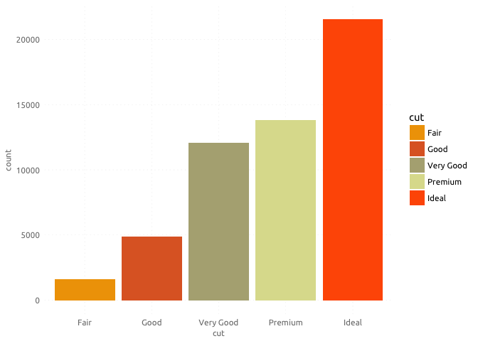

ggOBI
================

Overview
--------

This is my final project for the course SURV752 Data Vizualisation in the IPSDS program offered by the Universities of Mannheim and Maryland. The `ggOBI` package contains a ggplot2 theme for my favorite home improvement store OBI. So all the oranges and greys you can imagine and also a new take on an OBI color scheme, that my personal expert titled `obi_autumn`.

Installation
------------

``` r
devtools::install_github("markusntz/ggOBI")
library(ggOBI)
```

For the full OBI experience it might be necessary to install also additional fonts (here Ubunutu), the following code should do the trick:

``` r
install.packages("extrafont")
library(extrafont)
font_import()
loadfonts()
```

Usage
-----

You can use the package by adding the functions provided to your plots:

``` r
library(ggplot2)
library(ggOBI) 
library(extrafont)

p <- ggplot(diamonds, aes(cut, fill = cut)) + 
  geom_bar() + 
  scale_fill_obi(palette = "obi_autumn") + 
  theme_obi()

p 
```


